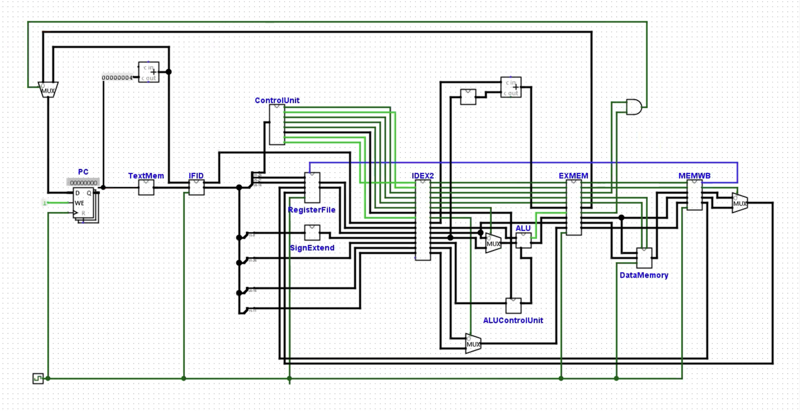

# Pipelined MIPS 32-Bit CPU



## Table of Contents

- [Introduction](#introduction)
- [Architecture Overview](#architecture-overview)
  - [Pipeline Stages](#pipeline-stages)
- [Components](#components)
- [Pipeline Registers](#pipeline-registers)
- [Hazard Handling](#hazard-handling)
- [Control Unit](#control-unit)
- [Data Path](#data-path)
- [Dependencies](#dependencies)
- [How to Run the Simulation](#how-to-run-the-simulation)
- [Acknowledgments](#acknowledgments)

---

## Introduction

This repository contains the implementation of a pipelined 32-bit MIPS CPU for my graduate Computer Architecture course. This CPU design mimics the MIPS architecture and implements a classic 5-stage instruction pipeline (IF, ID, EX, MEM, WB) to improve instruction throughput and demonstrate concepts like parallelism and pipelining in computer architecture. 

This project aims to provide a functional, cycle-accurate representation of how instructions are processed in a pipelined CPU, with added mechanisms to handle hazards and ensure data integrity.

## Architecture Overview

The MIPS CPU is designed with a 5-stage pipeline:
1. **Instruction Fetch (IF)** - Fetches the next instruction from memory.
2. **Instruction Decode (ID)** - Decodes the instruction, reads register values, and generates control signals.
3. **Execute (EX)** - Performs arithmetic/logic operations.
4. **Memory Access (MEM)** - Reads from or writes to data memory.
5. **Write Back (WB)** - Writes results back to the register file.

In this pipelined architecture, each stage works on a different instruction simultaneously, allowing multiple instructions to be processed in parallel, thus improving throughput.

### Pipeline Stages

#### 1. Instruction Fetch (IF)
- The Program Counter (PC) fetches the instruction from `TextMem`, which holds the instruction memory.
- After fetching, the PC is incremented to point to the next instruction, preparing for the next cycle.

#### 2. Instruction Decode (ID)
- The fetched instruction is decoded, and the control signals are generated in the **Control Unit**.
- Register values are read from `RegisterFile` based on the instruction's source register fields.
- The immediate values are sign-extended for compatibility with other units (like ALU).

#### 3. Execute (EX)
- The Arithmetic Logic Unit (ALU) performs operations like addition, subtraction, and logical operations based on the instruction type.
- The ALU operation is controlled by signals from the `ALUControlUnit`.
- Results are forwarded to the next stage or returned to previous stages if needed.

#### 4. Memory Access (MEM)
- The memory stage handles data loading and storing via the `DataMemory` component.
- Instructions that do not require memory access simply pass their results through to the next stage.

#### 5. Write Back (WB)
- The results are written back to the `RegisterFile` to update the specified destination register, completing the instruction cycle.

## Components

- **Program Counter (PC)**: Holds the address of the current instruction and increments after each cycle.
- **TextMem**: Instruction memory that stores the program’s instructions.
- **Control Unit**: Generates control signals based on the decoded instruction.
- **Register File**: Stores the CPU registers for use in operations.
- **Sign Extend**: Extends immediate values to 32-bits for ALU compatibility.
- **ALU (Arithmetic Logic Unit)**: Executes arithmetic and logical operations.
- **Data Memory**: Used for load and store instructions.
- **MUX (Multiplexer)**: Directs data flow to prevent hazards and ensure correct operation.

## Pipeline Registers

To maintain data flow across the pipeline, intermediate pipeline registers are used:
- **IF/ID**: Passes the instruction from the Instruction Fetch stage to the Instruction Decode stage.
- **ID/EX**: Passes decoded signals, register values, and sign-extended immediate values to the Execute stage.
- **EX/MEM**: Passes ALU results and control signals to the Memory Access stage.
- **MEM/WB**: Passes memory data or ALU results to the Write Back stage.

## Hazard Handling

This design includes mechanisms to handle data and control hazards:
1. **Data Hazards**: Forwarding paths and pipeline stalls are implemented to resolve dependencies between instructions.
2. **Control Hazards**: Branch prediction and flushing mechanisms are used to handle control hazards.

### Data Forwarding

Forwarding is implemented in the EX stage to handle dependencies between instructions by using values from later stages, thus avoiding unnecessary stalls.

### Pipeline Stalls

Certain instructions introduce dependencies that require a stall (e.g., load-use dependencies). This is managed by detecting such cases and inserting no-operation (NOP) cycles as necessary.

## Control Unit

The Control Unit generates control signals based on the instruction type (e.g., R-type, I-type, load, store, branch) and is responsible for:
- Specifying ALU operations.
- Enabling/disabling read and write on the `DataMemory`.
- Handling branching and jumps.

## Data Path

The data path is designed to facilitate the smooth flow of data through each pipeline stage. Multiplexers and control signals play a critical role in directing data correctly, ensuring that values are correctly computed and forwarded across the pipeline stages.

## Dependencies

To run this simulation, the following tools or software are required:
- **Logisim** 
This project was built using [Logisim Evolution version 3.9](https://github.com/logisim-evolution/logisim-evolution). Logisim Evolution is a digital logic design and simulation tool, ideal for educational use and available for free. Please download and install version 3.9 from the linked repository to ensure compatibility.

## How to Run the Simulation

1. Clone the repository:
   ```bash
   git clone https://github.com/yourusername/pipelined-mips-cpu.git
   cd pipelined-mips-cpu
   ```

2. **For Logisim**: Open `pipelined_mips.circ` in Logisim and start the simulation.


## Acknowledgments

This project was completed as part of my graduate course on Computer Architecture.
